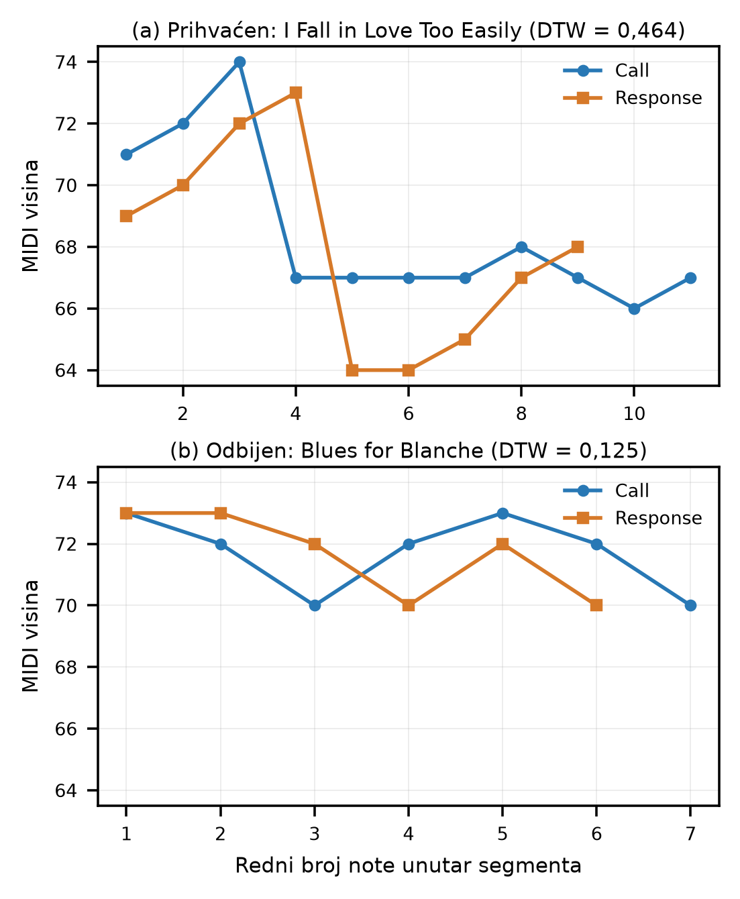

# Izdvajanje call-and-response parova iz jazz improvizacija: JazzDialog baza

Nikolina Zdravković; Maja Milović

## Sažetak

U radu je prikazan postupak izdvajanja call-and-response parova iz transkribovanih jazz solaža i nastanak baze JazzDialog. Kandidati su dobijani iz anotiranih granica fraza, poređeni melodijskim, intervalskim, konturama i ritmičkim osobinama, a zatim rangirani za ručni pregled. Posebna pažnja posvećena je dinamičkom vremenskom poravnanju (DTW). Analiza pokazuje da mala melodijska udaljenost nije dovoljna potvrda call-and-response odnosa: odbijeni kandidat može imati niži DTW skor od prihvaćenog. Konačni postupak zato kombinuje računarsko izdvajanje i rangiranje sa slušanjem i ručnom potvrdom. JazzDialog sadrži 114 potvrđenih zapisa iz 76 solaža, 73 naslova i 42 izvođača, sa preciznim granicama segmenata i MIDI isečcima.

Ključne reči: jazz improvizacija, call-and-response, analiza melodije, DTW, MIDI, baza podataka

## I. UVOD

Call-and-response je odnos dve uzastopne muzičke celine u kome druga celina odgovara, menja ili razvija ideju prve. U jazz improvizaciji takav odnos može nastati u samoj solaži, bez jasne granice između običnog ponavljanja, varijacije i odgovora. Zbog toga je automatsko izdvajanje zahtevno: slični nizovi nota nisu nužno muzički dijalog, a dobar response ne mora biti melodijski isti kao call.

Cilj rada bio je da se ispita kako se iz stvarnih jazz solaža mogu izdvojiti kandidati za call-and-response i da se formira proverljiva baza potvrđenih parova. Istraživačko pitanje je: kako numeričke osobine melodijskih segmenata pomažu pri pronalaženju muzički smislenog call-and-response odnosa? Konačni rezultat je JazzDialog, skup ručno potvrđenih parova sa vezom ka izvornim transkripcijama i MIDI isečcima.

## II. METOD

### A. Podaci i kandidati

Korišćene su monofone MIDI transkripcije solo improvizacija i prateće anotacije sistema Jazzomat / Weimar Jazz Database [1]. Svaka nota sadrži redni broj, početak, MIDI visinu i trajanje. Zvanično anotirane granice fraza korišćene su kao stabilan početni okvir, jer se ranija segmentacija pauzama pokazala previše krutom, a klizni prozori kroz ceo solo davali su previše lokalnih, muzički nepovezanih podudaranja.

U osnovnoj pretrazi jedna fraza se deli na dva uzastopna dela. Za svaku dozvoljenu tačku podele prvi deo je call, a drugi response. Kandidati sa premalo nota, prekratkim trajanjem ili izrazito neujednačenim dužinama su odbačeni. U kasnijoj verziji response je imao između polovine i dvostruke dužine call-a, a oba dela su trajala najmanje jednu sekundu. Ta ograničenja ne definišu call-and-response, već uklanjaju trivijalne slučajeve, na primer call od tri note i response od trideset nota.

### B. Numeričke osobine i rangiranje

Osnovna melodijska mera bilo je dinamičko vremensko poravnanje (DTW), koje poredi dve sekvence i dozvoljava lokalno poravnanje segmenata nejednake dužine [2]. Korišćen je optimalni put P kroz matricu razlika MIDI visina:

D(x,y) = sqrt(sum((x_i - y_j)^2) za (i,j) iz P) / |P|.

Manja vrednost označava bliže melodijsko poravnanje. Pored apsolutnih MIDI visina korišćena je transponovana, odnosno shape predstava, dobijena oduzimanjem prve note segmenta. Tako se može prepoznati sličan oblik na drugoj visini. Ispitan je i incipit, poređenje prvih nota call-a i response-a; u vrlo brzim frazama početak je proširivan do približno 0,75 s, jer tri kratke note nisu dovoljan signal.

Istraženi su i intervalski nizovi, sažeta melodijska kontura, relativni ritam zasnovan na međunotnim razmacima, median filter i ograničeno poravnanje. Nijedna pojedinačna mera nije korišćena kao definicija odnosa. U kasnijem koraku kandidati su rangirani korišćenjem DTW-a, incipita, odnosa dužina, zastupljenosti istih tonova, raznovrsnosti visina i približnog ponavljanja intervala. Negativno označeni primeri korišćeni su samo za blage kazne čestih loših obrazaca; obrazac nije strogo zabranjen, jer ponavljanje može biti deo validnog odgovora.

### C. Potvrda

Svaki predlog je izvezen u CSV tabelu i MIDI isečak sa razdvojenim call i response delom. Nakon slušanja je ručno označen kao DA ili NE. Sistem zato automatski pronalazi i rangira kandidate, dok muzički odnos potvrđuje slušanje. Oznake je obavila jedna anotatorka.

## III. REZULTATI I DISKUSIJA

Najjasniji nalaz odnosi se na ograničenje melodijske sličnosti. Slika 1 poredi dva stvarno pregledana kandidata. Prihvaćeni par iz sola „I Fall in Love Too Easily“ ima DTW skor 0,464, dok odbijeni par iz „Blues for Blanche“ ima manji skor, 0,125. U drugom slučaju veoma kratko, mehaničko ponavljanje tonova omogućava jeftino DTW poravnanje, ali se pri slušanju ne doživljava kao odgovor na prethodnu ideju. U prvom slučaju response nije kopija call-a, već razvija srodnu melodijsku misao.

Slika 1. Melodijske konture call-a i response-a za (a) prihvaćeni i (b) odbijeni kandidat. Horizontalna osa je redni broj note unutar segmenta, a vertikalna osa MIDI visina. Odbijeni primer ima znatno niži DTW skor, što pokazuje da skor sam nije odluka o muzičkoj funkciji.

Nalaz se vidi i na većem razvojnom skupu od 299 automatski izdvojenih kandidata: 101 je označen sa DA, a 198 sa NE. Na slici 2 horizontalna osa razdvaja dve grupe, dok vertikalna prikazuje globalni pitch-DTW skor podeljen dužinom puta. Violine pokazuju raspodelu, pojedinačne tačke kandidate, a crna linija centralni položaj raspodele. Grupe se snažno preklapaju, pa jedan prag može smanjiti broj predloga, ali ne može pouzdano potvrditi call-and-response vezu.

Slika 2. Raspodele normalizovanog globalnog DTW skora za ručno prihvaćene i odbijene automatske kandidate.

Na istom zamrznutom razvojnom skupu testirano je rangiranje kandidata uz petostruku podelu po solima i tri semena. Mera nije accuracy klasifikatora: predstavlja procenat DA kandidata među prvih 20% rangirane liste za slušanje. DTW sa incipitom davao je prosečno 42,78%, raniji rang sa više karakteristika 56,11%, a rang sa blagom kaznom intervalskih obrazaca 53,89%. Dakle, više osobina može poboljšati redosled pregleda, ali rezultat i dalje nije dovoljan da zameni slušanje. Pojedinačne mere ritma i konture nisu dale stabilno razdvajanje, a samostalna učestalost intervalskih obrazaca dala je 35,00%.

Konačni skup JazzDialog sadrži 114 ručno potvrđenih call-and-response zapisa iz 76 solaža, 73 naslova i 42 izvođača. Svaki zapis čuva identifikator sola, izvođača, naslov, granice i vremena call/response delova, nizove MIDI visina i putanju do MIDI isečka. Call delovi imaju medijanu od 9, a response delovi medijanu od 10 nota. Dvadeset šest anotacija u celosti je unutar jedne zvanične fraze, dok 88 prelazi njenu granicu. To pokazuje da su anotirane fraze korisne za kontrolisanu pretragu, ali nisu potpuna definicija muzičke ideje.

Za razliku od skupova namenjenih generisanju muzičkog odgovora [3], JazzDialog polazi od stvarnih improvizacija i dokumentuje postupak pronalaženja i ručne potvrde odnosa koji se već dogodio. Njegov doprinos je proverljiva kolekcija i negativan rezultat važan za dalji rad: melodijska sličnost hvata deo odnosa, ali ne obuhvata njegovu muzičku funkciju.

## IV. ZAKLJUČAK

Računarska analiza može efikasno izdvojiti i poređati kandidate za call-and-response u jazz solažama, ali nijedna ispitana pojedinačna mera nije bila dovoljna za pouzdanu konačnu odluku. DTW je bio koristan za poređenje i vizuelnu analizu, ali primeri i raspodele pokazuju da manja udaljenost ne znači nužno bolji muzički odgovor. Konačni hibridni postupak — izdvajanje i rangiranje kandidata, preslušavanje i ručna potvrda — doveo je do baze JazzDialog sa 114 parova. Ograničenja su subjektivnost pojma, jedna anotatorka, monofone transkripcije i činjenica da su razvojne oznake korišćene pri oblikovanju kriterijuma. Sledeći koraci su nezavisna anotacija više muzičara, proširenje baze i učenje na većem skupu.

## LITERATURA

[1] M. Pfleiderer, K. Frieler, J. Abeßer, W. G. Zaddach i B. Burkhart, ur., *Inside the Jazzomat: New Perspectives for Jazz Research*. Mainz: Schott Campus, 2017.

[2] M. Müller, *Fundamentals of Music Processing: Audio, Analysis, Algorithms, Applications*. Cham: Springer, 2015, doi: 10.1007/978-3-319-21945-5.

[3] Y. Hu, Z. Wang, R. Liu, Y. Liang i Y. Zhang, “Responding to the Call: Exploring Automatic Music Composition Using a Knowledge-Enhanced Model,” *Proc. AAAI Conf. Artif. Intell.*, vol. 38, no. 1, pp. 521–529, 2024, doi: 10.1609/aaai.v38i1.27807.
