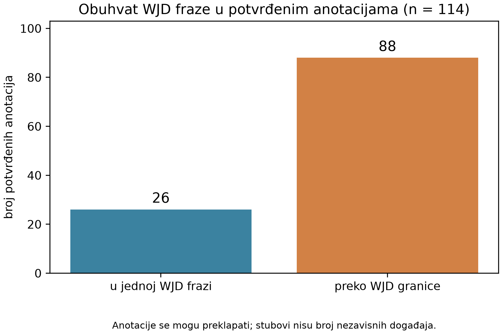
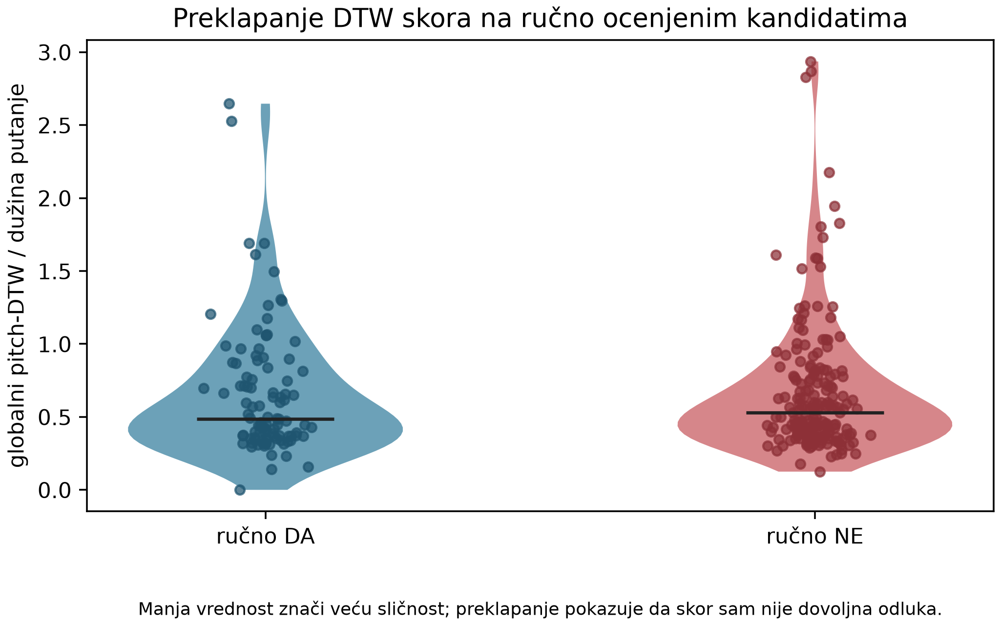
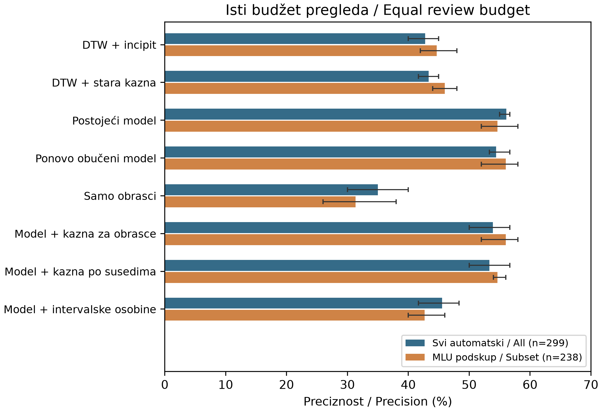

# JazzDialog: izgradnja i analiza zbirke call-and-response parova u jazz solažima

Nikolina Zdravković

Mentorka: Maja Milović

## Sažetak

Prepoznavanje call-and-response odnosa u jazz improvizaciji zahteva razlikovanje muzičkog dijaloga od prostog ponavljanja. U ovom radu predstavljena je zbirka JazzDialog, izgrađena nad simboličkim transkripcijama Weimar Jazz Database kombinovanjem algoritamskog predlaganja i ručne provere. Zbirka sadrži 114 potvrđenih anotacija iz 76 sola, sa preciznim granicama oba segmenta, izvornim visinama i vremenima nota i odgovarajućim MIDI isečcima. Trinaest zapisa povezano je sa početnim ručnim referencama. Ispitano je rangiranje kandidata dinamičkim vremenskim poravnanjem (DTW), jednostavnim modelom obučenim na ljudskim oznakama i dodatnim statističkim kaznama. U retrospektivnoj grupisanoj validaciji na 299 algoritamskih kandidata, preciznost među predlozima pri istom budžetu pregleda iznosila je prosečno 42,8% za DTW sa poređenjem početaka i 54,4% za ponovo obučeni model sa deset osobina. Dodatne kazne nisu dale dosledno poboljšanje. Od potvrđenih anotacija, 88 prelazi granice zvaničnih WJD fraza. Rezultati ukazuju na značaj izbora granica i ručne potvrde: niska melodijska udaljenost nije dovoljna potvrda call-and-response veze. Doprinos rada je proverljiva zbirka, postupak njenog formiranja i dokumentovana analiza ograničenja primenjenih metoda.

Ključne reči: jazz improvizacija, call-and-response, muzički podaci, DTW, ljudska anotacija, rangiranje kandidata.

## 1. Uvod

U ovom radu call-and-response označava odnos dva vremenski uređena dela sola: prvi uspostavlja prepoznatljivu muzičku ideju, a drugi se pri slušanju doživljava kao njen odgovor ili nastavak. Odgovor može ponoviti početak, promeniti visine ili razviti motiv. Zbog toga jednaki nizovi nota nisu ni neophodan ni dovoljan uslov takvog odnosa. Posebno je teško razlikovati muzički dijalog od kratkog obrasca koji se mehanički ponavlja.

Problem je posmatran iz ugla izgradnje podataka. Potrebno je pronaći odnose koje je moguće ponovo locirati u izvornom solu, preslušati i koristiti u narednim istraživanjima. Potpuno automatska odluka bila bi praktična, ali greške u takvoj odluci direktno bi umanjile vrednost zbirke. Zato je razvijen postupak u kome algoritam predlaže i rangira kandidate, dok konačnu odluku donosi ljudski ocenjivač.

Istraživanje ima dva povezana pitanja. Prvo, koliko mere sličnosti visina nota i učenje iz prethodnih ocena pomažu da se među ograničenim brojem predloga pronađu dobri parovi? Drugo, kakav opis podataka omogućava da prihvaćeni parovi budu proverljivi i ponovo upotrebljivi? Cilj nije modelovanje celokupnog jazz izraza, već izgradnja jasno dokumentovane zbirke i procena korisnosti jednostavnih postupaka za njeno formiranje.

Doprinos rada čine povezivanje pozitivnih anotacija sa konkretnim WJD događajima, objedinjavanje algoritamskih i početnih ručnih referenci, prenosivi format CSV/JSON/MIDI i poređenje metoda rangiranja na označenim kandidatima. Ne tvrdi se da je ovo prvi skup call-and-response podataka niti da rezultat predstavlja opšte rešenje za automatsko razumevanje muzičkog dijaloga.

## 2. Povezana istraživanja

WJD obezbeđuje transkripcije jazz solaža, metapodatke i muzičke anotacije potrebne za računarsku analizu improvizacije (Pfleiderer et al. 2017). Pored granica fraza, za ovaj rad značajne su jedinice srednjeg nivoa, odnosno midlevel units (MLU). Taj pristup opisuje lokalne muzičke ideje i njihove odnose između nivoa pojedinačne note i celokupne forme sola (Frieler et al. 2016). MLU veza može biti koristan predlog mesta za pregled, ali sama po sebi nije oznaka call-and-response odnosa prema kriterijumu ove zbirke.

DTW omogućava poređenje sekvenci nejednake dužine i lokalno prilagođavanje njihovog poravnanja. Njegova primena u obradi muzike i ograničenja putanje obrađeni su u literaturi o muzičkim informacijama (Müller 2015). U ovom radu DTW se primenjuje na nizove MIDI visina. Matematičko poravnanje se ne poistovećuje sa perceptivnom procenom odnosa dve fraze.

Salamon et al. (2012) koriste statističke osobine kontura za izdvajanje melodije iz polifonog zvuka. Taj rad je motivisao razmatranje reprezentacije konture, ali njegov zadatak se razlikuje od ovde posmatranog: WJD već obezbeđuje monofonu transkripciju, dok treba utvrditi odnos dva njena segmenta. Njihov indeks melodijskog karaktera nije neposredno primenjen kao klasifikator call-and-response parova.

Postoje i skupovi namenjeni generisanju muzičkog odgovora. Hu et al. (2024) predstavljaju Call-Response Dataset i model koji koristi melodijsko, ritmičko i harmonijsko znanje za kompoziciju. JazzDialog ima uži cilj: ručno proverene odnose u konkretnim improvizovanim jazz solažima, sa izričitim granicama i vezom prema izvornoj transkripciji. Razlika u zadatku ne opravdava tvrdnju o prvenstvu, ali određuje namenu ove zbirke.

Za opis podataka korišćeni su principi jasnog dokumentovanja izvora, postupka prikupljanja i ograničenja (Gebru et al. 2021), kao i identifikacije i ponovne upotrebe istraživačkih podataka (Wilkinson et al. 2016). Praktična posledica je razdvajanje jednostavne pozitivne zbirke od detaljne istorije eksperimentisanja.

## 3. Podaci i postupak anotiranja

### 3.1. Izvor i jedinica zapisa

Korišćena je lokalna WJazzD baza 2.1, koja sadrži 456 sola. Note se čitaju iz SQLite baze po identifikatoru sola, sa visinom, početkom i trajanjem. Granice zvaničnih fraza čitaju se iz tabele sections za tip PHRASE. Izvorna završna granica je uključiva; pri izvozu je pretvorena u isključivu granicu, što odgovara Python isečku niza. Metapodaci, kao što su tonalitet i prosečan tempo, preuzeti su za ceo solo i nisu predstavljeni kao automatska analiza lokalnog para (Jazzomat, dokumentacija baze).

Jedinica konačne zbirke je anotacija sa dva segmenta: call i response. Segmenti čuvaju izvorni redosled i WJD vremena nota. CSV omogućava pregled, JSON sadrži potpune događaje i dodatne podatke o poreklu, a MIDI omogućava slušanje. MIDI visine i trajanja verno predstavljaju transkripciju, ali ne reprodukuju sve osobine originalnog audio izvođenja.

### 3.2. Operativni kriterijum i ljudski pregled

Kandidati su preslušavani kao isečci sa odvojenim CALL i RESPONSE trakama. Autorka je upisivala DA kada je čula smislenu celinu u kojoj drugi deo odgovara na prepoznatljivu ideju prvog. Oznaka NE dodeljivana je predlozima koji su zvučali kao nepovezani segmenti, izolovane brze mikrofraze ili ponavljanje bez jasnog odnosa pitanja i odgovora. Ove razlike su perceptivne odluke jednog ocenjivača, a ne univerzalna formalna definicija.

Tokom razvoja proveravane su i granice: odgovor ponekad počinje notom koja perceptivno pripada završetku call-a, ili se nastavlja posle kraja smislene celine. Prihvaćene korekcije sačuvane su zajedno sa granicama. Ocenjivač nije bio slep za prethodne predloge i ocene, što predstavlja ograničenje postupka. Nije sprovedena nezavisna procena više anotatora.

Radni dnevnik na završetku sadrži 312 označenih zapisa, od kojih 114 DA i 198 NE. Negativni zapisi nisu deo glavne pozitivne zbirke, ali ostaju sačuvani za analizu grešaka i učenje redosleda pregleda. Neoznačena fraza ili kandidat koji nije prošao filter ne tretira se kao negativan primer.

### 3.3. Povezivanje početnih ručnih referenci

Početna Excel tabela sadrži 21 zapis sa imenima nota, oktavama, trajanjima i dodatnim muzičkim beleškama. Visine su pretvorene u MIDI brojeve, uz uvažavanje transpozicije instrumenta, vezanih nota i različitog oktavnog zapisa. Potom je tražena odgovarajuća kontinuirana sekvenca u konkretnom WJD solu. Za ovaj korak nije korišćeno slobodno DTW razvlačenje kojim bi se nepodudarne note prikazale kao isti zapis.

Trinaest referenci povezano je sa WJD podacima. Osam je već bilo u pregledanim rezultatima, dok je pet dopunilo zbirku. Četiri novododata mapiranja sadrže male razlike u zapisanim visinama, proverene prema WJD notnim transkripcijama. Razlike, transpozicije i dopunjene oktave sačuvane su u posebnom zapisu provere. Jedna ranije prihvaćena referenca ima odstupanje response-a u izvornom Excelu; zadržane su ranije potvrđene WJD granice. Takvi slučajevi nisu označeni kao doslovna poklapanja.

Sedam referenci odnosi se na snimke kompozicija It Could Happen to You i Well You Needn't koji nisu pronađeni u lokalnom WJD-u. Jedan zapis za Two's Blues je nepotpun. Oni nisu uključeni uz izmišljene identifikatore. Trajanja u objavljenoj zbirci preuzeta su iz WJD-a, a ne iz nejasnih oznaka ritma u Excelu. Veza između broja originalne reference i konačnog broja dostupna je u dokumentaciji baze.

## 4. Metode predlaganja i rangiranja

### 4.1. Osnovna podela fraze

Za frazu sa n nota isprobava se svaka dozvoljena tačka s, čime nastaju call = p[0:s] i response = p[s:n]. Osnovni postupak pokriva celu frazu, bez razmaka. Najbolja podela minimizuje kombinovani skor globalnog poređenja i poređenja početaka. To je jednostavan početni model, čija ograničenja mogu jasno da se prate.

Neka su x i y nizovi visina dužina m i n. DTW pronalazi monotonu putanju P kroz matricu parova nota, uz standardne horizontalne, vertikalne i dijagonalne korake. U primenjenoj DTAIDistance implementaciji podrazumevani trošak je koren sume kvadrata razlika duž optimalne putanje. Korišćeni skor je:

D(x,y) = sqrt(sum_(i,j in P) (x_i - y_j)^2) / |P|. (1)

Imenilac je stvarni broj parova na izabranoj putanji, a ne veća od dužina sekvenci. Incipit skor I poredi prvih k nota apsolutno i posle oduzimanja prve visine svake sekvence, pa uzima manju od te dve udaljenosti. Kombinacija je:

S(x,y) = alpha D(x,y) + (1 - alpha) I(x,y). (2)

U završnoj evaluaciji korišćeni su alpha = 0,8 i početno k = 3. Pri prosečnom tempu od najmanje 215 BPM broj početnih nota povećava se dok zbir njihovih trajanja na obe strane ne dosegne 0,75 s. Uzima se veći potrebni broj nota; ako oba dela nisu dovoljno duga, incipit skor zamenjuje se globalnim skorom. Ovo je zadržana razvojna heuristika, ne naučeno pravilo ritma. Manji skor predstavlja veću sličnost, ne veću verovatnoću muzičke ispravnosti. Postupak za jednu tačku podele troši O(mn) vremena i memorije za matricu poravnanja. Isprobavanje svih tačaka podele jedne fraze zato u najgorem slučaju zahteva O(n^3) vremena i O(n^2) radne memorije. Ne pretražuju se sve kombinacije početaka, krajeva i razmaka.

### 4.2. Filteri, druge granice i razvojne varijante

Kratki delovi, velika razlika broja nota i ponavljanje istog kratkog motiva često su davali matematički povoljne, a perceptivno slabe rezultate. Tokom razvoja uvedena su ograničenja dužine i trajanja i odbacivanje izrazitih ponavljanja. U jednoj od korišćenih konfiguracija zahtevalo se najmanje pet nota po delu i odnos dužina između 1:2 i 2:1; proveravano je i minimalno trajanje. To su heuristike za izbor kandidata, ne uslovi koji retroaktivno određuju validnost svih ručno prihvaćenih parova.

Pošto su potvrđeni odnosi često prelazili granicu fraze, razvijen je i predlagač zasnovan na WJD MLU/IDEA odnosima. On koristi postojeću ljudsku analizu strukture sola da ograniči prostor pretrage. Zbog toga njegov uspeh ne predstavlja automatsko prepoznavanje strukture samo iz sirovih nota. Primena različitih predlagača tokom prikupljanja takođe znači da završni skup nije slučajan uzorak svih mogućih segmenata.

Razmatrana su poređenja relativnih intervala, konture i razmaka između početaka nota. Zbirni rezultati za sve istorijske konfiguracije nisu uporedivi jer su menjani skupovi kandidata i filteri. Zato se ti pokušaji ne prikazuju kao kontrolisana potvrda superiornosti ili beskorisnosti ritma. Završno kvantitativno poređenje ograničeno je na jasno izdvojen skup i isti budžet ljudskog pregleda.

### 4.3. Učenje redosleda iz DA/NE oznaka

Model za rangiranje je regularizovana logistička regresija sa deset osobina: apsolutni i transpozicioni DTW, dužine oba segmenta, njihova relativna neravnoteža, udeo zajedničkog motiva, najveći udeo jednog tona u svakom segmentu i udeo različitih tonova u svakom segmentu. Standardizacija se računa na trening skupu. Implementacija koristi 2.500 gradijentnih koraka, korak 0,08 i L2 koeficijent 0,02; slobodni član se ne regularizuje. Izlaz služi rangiranju i nije nezavisno kalibrisana verovatnoća.

Dodatno je ispitana blaga kazna za intervalske obrasce češće među NE primerima. Obrazac obuhvata dva ili tri uzastopna pomeraja visine, svrstana u devet opsega. Statistika razlikuje prisustvo u call-u, response-u i oba dela. Jedan obrazac doprinosi najviše jednom po paru i ulozi. Za korišćenje se zahteva najmanje pet trening primera iz tri sola, a procena se ublažava sa pet pseudoopažanja prema trening udelu DA. Kazna 0,35 puta pozitivni deo razlike između polaznog i procenjenog udela DA umanjuje izlaz modela. Nije uvedena apsolutna zabrana obrasca.

Poređene su i kazna zasnovana na 15 najbližih primera u standardizovanom prostoru osobina i varijanta sa dodatne 22 intervalske osobine. Postojeća kazna za sličnost najbližem poznatom NE primeru ostala je odvojena kontrola. Ovde se ispituje da li dodatno učenje iz negativnih primera donosi nešto preko već obučenog jednostavnog modela.

## 5. Protokol evaluacije

Evaluacija je retrospektivna i koristi snimak radne tabele pre poslednjeg dopunjavanja ručnim referencama: 307 označenih zapisa, od kojih 109 DA i 198 NE. Osam tadašnjih ručnih referenci izostavljeno je iz poređenja predlagača. Preostalih 299 algoritamskih kandidata sadrži 101 DA i 198 NE iz 166 sola. MLU podskup ima 238 kandidata, 87 DA i 151 NE iz 152 sola. Kasnije dodate ručne reference nisu korišćene da poprave te rezultate.

Korišćena je petostruka unakrsna validacija grupisana po solu, ponovljena za tri unapred zadate vrednosti inicijalizacije: 11, 29 i 47. Nijedan solo nije istovremeno u trening i test delu iste podele. Parametri standardizacije, težine modela, statistike obrazaca i negativne reference računaju se isključivo na treningu, u skladu sa pravilima sprečavanja curenja podataka (scikit-learn, dokumentacija).

Glavna mera je preciznost pri fiksnom budžetu pregleda: broj DA među najbolje rangiranih 20% kandidata svakog test dela, uz zaokruživanje naviše. Ukupno se tako bira 60 kandidata za skup od 299, odnosno 50 za MLU podskup. Svi modeli dobijaju isti broj predloga. Ova mera odgovara praktičnom pitanju koliko dobrih primera ocenjivač dobija za isti broj preslušavanja. Nije accuracy nad svim WJD frazama, niti odziv nad svim stvarnim call-and-response pojavama.

Provereno je i izdvajanje izvođača iz treninga, kao i jedna varijanta bez vremenski preklapajućih zapisa. Kontrole su potvrdile da promena test oznaka ne menja izračunate skorove i da su osnovne funkcije reprodukovane. Ipak, razvojni podaci su ranije uticali na izbor metoda i filtera: grupisana validacija ne pretvara ih u netaknut završni test. Tri ponavljanja koriste iste primere i ne predstavljaju tri nezavisno prikupljena skupa.

## 6. Rezultati

### 6.1. Sastav i granice zbirke

Konačna pozitivna zbirka ima 114 anotacija iz 76 sola, 73 različita naslova i 42 izvođača. Call segmenti sadrže ukupno 1.136 nota, a response segmenti 1.278 nota. Medijane dužina su devet i deset nota; opsezi su 5-25 i 6-38 nota. Veći broj nota nije automatska garancija smislenog odnosa, ali ove vrednosti opisuju stvarno sačuvane segmente.

Dvadeset šest anotacija nalazi se u celosti u jednoj WJD frazi, a 88, odnosno 77,2%, prelazi najmanje jednu njenu granicu (slika 1). To pokazuje da bi strogo ograničenje na jednu frazu isključilo znatan deo ove zbirke. Pošto su korišćeni različiti načini predlaganja, procenat ne predstavlja procenu raspodele svih call-and-response odnosa u WJD-u.

Slika 1. Položaj potvrđenih anotacija prema zvaničnim WJD frazama (n = 114). / Figure 1. Confirmed annotations within and across official WJD phrase boundaries (n = 114). This is a description of the curated collection, not a corpus-wide prevalence estimate.

Sedamnaest zapisa pripada osam grupa sa preklapanjem. Neke grupe sadrže alternativne prihvaćene granice, a druge parove koji dele jedan segment. Broj redova zato ne treba poistovećivati sa brojem nezavisnih događaja. Zapisi nisu automatski obrisani, već je njihova povezanost sačuvana u JSON-u.

### 6.2. Sličnost nije dovoljna potvrda

Na slici 2 prikazana je raspodela jednako preračunatog globalnog pitch-DTW skora za 299 algoritamskih kandidata. Pozitivni i negativni primeri imaju preklapajuće vrednosti. Mala udaljenost stoga ne određuje jednoznačno ljudsku oznaku; grafikon ne utvrđuje uzrok svakog pojedinačnog odbijanja.

Slika 2. Globalni DTW prema jednačini (1), bez naknadnih kazni: 101 DA i 198 NE. Tačke su pojedinačni kandidati, a širina oblika prikazuje procenjenu gustinu. / Figure 2. Global pitch-DTW score for 101 accepted and 198 rejected automatic candidates. Lower values indicate greater similarity; the distributions overlap.

Uočene greške uključuju kratka brza podudaranja, ponovljene tonove koji se povoljno poravnavaju i granice koje presecaju muzičku misao. To su kvalitativne opservacije tokom pregleda. Pošto svi NE primeri nisu nezavisno označeni kategorijom greške, nije procenjen pouzdan procenat pojedinačnih uzroka.

### 6.3. Poređenje rangiranja

Tabela 1 prikazuje srednju preciznost kroz tri grupisane podele istih podataka. Postojeći model koristi ranije izabrani izvor trening kandidata, dok ponovo obučeni model koristi sve dozvoljene trening oznake. Ta razlika je izdvojena da se efekat promene trening skupa ne pripiše novoj reprezentaciji.

Tabela 1. Preciznost pri istom budžetu pregleda (%). / Table 1. Mean precision under the same review budget (%); 60 selected candidates for all automatic proposals and 50 for the MLU subset in each repetition.

| Metoda | Svi, n = 299 | MLU, n = 238 |
| --- | ---: | ---: |
| DTW + incipit | 42,8 | 44,7 |
| DTW + postojeća NE kazna | 43,3 | 46,0 |
| Postojeći model za rangiranje | 56,1 | 54,7 |
| Ponovo obučeni model, 10 osobina | 54,4 | 56,0 |
| Samo učestalost obrazaca | 35,0 | 31,3 |
| Model + kazna za obrasce | 53,9 | 56,0 |
| Model + kazna prema susedima | 53,3 | 54,7 |
| Model + intervalske osobine | 45,6 | 42,7 |

Na MLU podskupu ponovo obučeni model daje 26/50, 29/50 i 29/50 dobrih predloga. Nova kazna za obrasce daje iste ukupne brojeve. Kazna prema susedima daje 27/50, 28/50 i 27/50, a prošireni intervalski model 21/50, 23/50 i 20/50. Dodatne osobine i kazne nisu donele dosledan napredak u odnosu na jednostavniju kontrolu (slika 3).

Slika 3. Srednja preciznost i opseg rezultata tri podele; crte nisu intervali poverenja. / Figure 3. Mean precision and range across three grouped splits. Error bars are split ranges, not confidence intervals; repetitions reuse the same labelled candidates.

Kada se grupiše po izvođaču, ponovo obučeni model na MLU podskupu daje prosečno 52,0%, a model sa kaznom za obrasce 53,3%. Posle uklanjanja preklapanja ostaje 263 kandidata; u jednoj proveri kontrola daje 30/55 dobrih predloga, a nova kazna 31/55. Ovi mali pomaci nisu osnova za tvrdnju o stabilnom poboljšanju.

Ispitan je i izbor praga koji u unutrašnjoj validaciji cilja preciznost od 80%, uz najmanje deset predloga iz tri grupe. Kazna za obrasce nije dala prihvatljivu selekciju. DTW na MLU podskupu daje male selekcije 5/6, 6/7 i 10/12, ali na celom mešanom skupu 1/3, 2/4 i 4/6. Prema tome, pojedinačan dobar rezultat pri niskom pragu nije dovoljan za deklarisanje opšte pouzdanosti od 80%.

## 7. Diskusija

Rezultati ukazuju na dva odvojena problema: izbor granica i ocenu odnosa. Ako kandidat ne obuhvata odgovarajuću muzičku celinu, kvalitetnija mera sličnosti ne može sama vratiti izostavljene note. Veliki broj potvrđenih anotacija preko granica fraza podržava proširenje prostora predlaganja, ali široka pretraga istovremeno stvara više prilika za slučajna podudaranja. Zato veći broj niskih skorova nije sam po sebi napredak.

Važno svojstvo jednačine (1) jeste zavisnost skale od dužine putanje. Ako su sve apsolutne razlike na putanji jednake e, onda je skor e/sqrt(|P|). Duža putanja može dobiti manji skor iako prosečno odstupanje nije manje. Ovo je matematičko svojstvo korišćene normalizacije, a ne novo izmerena stopa greške. RMS odstupanje sqrt(sum(error^2)/|P|) imalo bi drugačiju skalu. Njegovo uvođenje zahtevalo bi novu kalibraciju i nezavisan test; stari pragovi se ne mogu neposredno preneti.

Pored toga, slobodna horizontalna i vertikalna kretanja mogu više nota jednog segmenta poravnati sa istom notom drugog. Izabrana putanja minimizuje akumulisani trošak, a ne direktno konačni količnik. Ograničavanje nagiba ili dužine niza takvih koraka predstavlja smislen naredni eksperiment, ali njegova korisnost ovim radom nije dokazana. Ni sabiranje uzastopnih intervala od prve note ne stvara automatski novu informaciju: takav zbir je upravo razlika trenutne i prve visine.

Jednostavan model sa ljudskim oznakama u proseku je bolje rangirao razvojne kandidate od DTW osnove, ali približno polovina predloga u fiksnom budžetu i dalje nije prihvaćena. Neuspeh dodatne kazne ne znači da negativne oznake nisu korisne: osnovni model ih već koristi. Pokazuje da konkretna dodatna reprezentacija nije dosledno smanjila trošak pregleda na ovom uzorku.

Vrednost konačne zbirke potiče iz proverljivih anotacija, a ne iz tvrdnje da je detektor sam pouzdan. Ljudska potvrda ne pretvara ove podatke u apsolutnu muzičku istinu. Jedan ocenjivač, razvojno menjani kriterijumi, pristrasnost izbora kandidata, preklapanja i korišćenje izvornih ručnih MLU anotacija ograničavaju generalizaciju. Ne postoje potpun popis svih CR odnosa, procena odziva nad WJD-om ni merenje slaganja ocenjivača. Rezultati zato ne dokazuju da računari načelno ne mogu da prepoznaju jazz dijalog.

## 8. Format, ponovljivost i dalja upotreba

Glavna datoteka jazzdialog.csv sadrži 24 kolone. Prve su redni identifikator, izvođač, naslov, WJD identifikator i tonalitet; zatim slede metapodaci, granice, vremena, broj i visine nota i putanja MIDI fajla. Redovi su uređeni po izvođaču, naslovu i mestu u solu, sa identifikatorima 1-114. Odgovarajući fajlovi nose nazive jazzdia-1.mid do jazzdia-114.mid. Ako se sastav ponovo sortira, redni identifikatori mogu se promeniti; trajna veza sa izvorom određena je WJD identifikatorom i granicama, uz sačuvan Git snimak.

JSON čuva svaku notu i podatke o poreklu i preklapanju. Izvoz automatski proverava visine, početke, trajanja, obe MIDI trake i usklađenost CSV-a sa manifestom. Prenosivi ZIP može se proveriti i bez lokalne WJD baze. Odbijeni primeri čuvaju se u razvojnoj istoriji, ali se ne mešaju sa glavnim skupom pozitivnih parova. Izvorni uslovi WJD-a, ODbL i DbCL, ostaju relevantni za izvedene podatke.

Kod, podaci i dokumentacija dostupni su u repozitorijumu https://github.com/NikolinaZdravkovic/jazzdialog. Skripta export_reviewed_dataset.py obnavlja zbirku, a evaluate_feedback_patterns.py sprovodi opisano poređenje. Eksperimentalni snimak oznaka identifikuje SHA-256 6d3c073282ccb9cc41b279bf24a21c8d02b54d60a3dede8c8ae2ca217d320fde i Git commit d6c4003. Sažeti rezultati za tabele i grafikone sačuvani su uz rad. Razvojni parametri i dodatne provere dokumentovani su u RESEARCH.md.

Za treniranje na ovim podacima potrebno je odvojiti cele soloe, a po potrebi i izvođače, između treninga i testa. Pozitivna zbirka sama nije klasifikacioni test: neophodni su posebno označeni negativni primeri. Najvažniji naredni koraci su drugi nezavisni anotator, preciznije beleženje vrste odnosa i greške granice, pa tek zatim testiranje novih mera na do tada neviđenim i sistematski anotiranim soloima.

## 9. Zaključak

Izgrađena je zbirka od 114 proverljivih call-and-response anotacija, sa simboličkim sadržajem i jasnom vezom prema WJD izvorima. Postupak je objedinio računarsko predlaganje, ljudski pregled i povezivanje početnih ručnih primera. Retrospektivno poređenje pokazalo je korist jednostavnog učenja redosleda pregleda u odnosu na DTW osnovu, ali ne i doslednu korist dodatnih statističkih kazni. Sličnost visina i zvanične granice fraza ne predstavljaju dovoljno pouzdanu automatsku odluku. Zbirka i dokumentovane greške daju osnovu za narednu proveru granica i modela, uz očuvanje razlike između merljive sličnosti i ljudske procene muzičkog odnosa.

## Literatura

Frieler, K., Pfleiderer, M., Zaddach, W.-G., Abeßer, J. 2016. Midlevel analysis of monophonic jazz solos: A new approach to the study of improvisation. Musicae Scientiae. https://doi.org/10.1177/1029864916636440

Gebru, T., Morgenstern, J., Vecchione, B., Vaughan, J. W., Wallach, H., Daumé III, H., Crawford, K. 2021. Datasheets for Datasets. Communications of the ACM, 64(12): 86-92. https://doi.org/10.1145/3458723

Hu, Z., Liu, Y., Chen, G., Ma, X., Zhong, S., Luo, Q. 2024. Responding to the Call: Exploring Automatic Music Composition Using a Knowledge-Enhanced Model. Proceedings of the AAAI Conference on Artificial Intelligence, 38(1): 521-529. https://doi.org/10.1609/aaai.v38i1.27807

Jazzomat Research Project. Dokumentacija Weimar Jazz Database: pregled i format baze. https://jazzomat.hfm-weimar.de/dbformat/dboverview.html i https://jazzomat.hfm-weimar.de/dbformat/dbformat.html (pristupljeno 29. 9. 2026).

Müller, M. 2015. Fundamentals of Music Processing: Audio, Analysis, Algorithms, Applications. Cham: Springer. https://doi.org/10.1007/978-3-319-21945-5

Pfleiderer, M., Frieler, K., Abeßer, J., Zaddach, W.-G., Burkhart, B. (ur.) 2017. Inside the Jazzomat: New Perspectives for Jazz Research. Schott Campus. https://jazzomat.hfm-weimar.de/

Salamon, J., Peeters, G., Röbel, A. 2012. Statistical Characterisation of Melodic Pitch Contours and its Application for Melody Extraction. Proceedings of ISMIR 2012, 187-192. https://www.justinsalamon.com/uploads/4/3/9/4/4394963/salamonmelodiccontourismir12.pdf

scikit-learn developers. Cross-validation: iterators for grouped data; Common pitfalls: data leakage. https://scikit-learn.org/stable/modules/cross_validation.html i https://scikit-learn.org/stable/common_pitfalls.html (pristupljeno 29. 9. 2026). Referenca za protokol evaluacije; model projekta implementiran je u NumPy-ju.

Wilkinson, M. D. et al. 2016. The FAIR Guiding Principles for scientific data management and stewardship. Scientific Data, 3: 160018. https://doi.org/10.1038/sdata.2016.18

## English summary

### JazzDialog: Building and analysing a collection of call-and-response pairs in jazz solos

This study presents JazzDialog, a human-verified collection of call-and-response annotations linked to symbolic solo transcriptions in the Weimar Jazz Database (WJD). The objective is to create reusable data and examine how computational similarity can reduce the cost of human review, rather than to claim fully automatic recognition of musical dialogue.

The collection contains 114 annotations from 76 solos, covering 73 tune titles and 42 performers. Each annotation includes the two segments' note boundaries, pitches and original WJD timing, with a corresponding MIDI excerpt containing separate CALL and RESPONSE tracks. Thirteen records are linked to the author's initial manual references. Seven other references concern recordings absent from the local WJD, and one is incomplete; they were not assigned fabricated source identities.

Candidates were proposed by splitting official phrases and by using existing WJD midlevel-unit relationships. A single reviewer listened to the excerpts and accepted or rejected each candidate. Of the accepted annotations, 88 cross an official phrase boundary (Figure 1). Seventeen records belong to eight overlap groups and should not be treated as independent observations. These figures describe the curated collection, not the prevalence of call-and-response across the entire corpus.

A retrospective evaluation compared DTW-based ranking, a ten-feature logistic model and additional soft penalties learned from negative examples. The evaluation snapshot contained 299 automatic proposals, including 101 accepted and 198 rejected candidates; separately selected manual references were excluded. Five-fold validation grouped by solo was repeated with three fixed seeds. Models selected the same top 20% of candidates within each held-out fold, giving 60 proposals per repetition. Mean precision was 42.8% for DTW with incipit comparison and 54.4% for the refitted ten-feature model. The strongest existing-model variant reached 56.1% on this mixed set. On the 238-candidate midlevel subset, the refitted model and its pattern-penalty variant both reached 56.0%. Additional penalties did not yield a consistent benefit (Table 1 and Figure 3).

Accepted and rejected candidates have overlapping DTW scores (Figure 2). The analysis also identifies a length dependence in the implemented distance normalization, which must be distinguished from perceptual similarity. The results are limited by prior development on these labels, candidate-selection bias, one reviewer and the absence of exhaustive annotations or independent test solos. They do not establish corpus-wide recall or a general impossibility of automatic recognition. JazzDialog contributes traceable positive annotations, portable data and a documented baseline for future boundary and ranking experiments.
